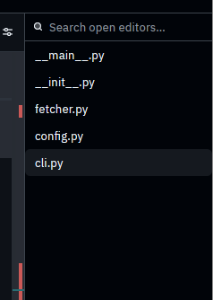

# Open Editors Panel — Zed Fork

This is a fork of [Zed](https://github.com/zed-industries/zed) with a custom **Open Editors Panel** added.



## What Was Added

A new panel that shows all currently open editors in the active pane, with a live search/filter bar. It docks to the left or right side and persists its position via user settings.

### Features

- Lists all open editor tabs in the active pane
- Highlights the currently active editor
- Search/filter bar to quickly find an open file by name
- Click any entry to switch to that editor
- Dockable left or right — position persists across sessions via `~/.config/zed/settings.json`

## Files Changed

| File | Change |
|------|--------|
| `crates/open_editors_panel/src/open_editors_panel.rs` | New panel implementation |
| `crates/open_editors_panel/src/open_editors_panel_settings.rs` | Settings struct (`dock`, `default_width`) |
| `crates/settings_content/src/settings_content.rs` | Added `open_editors_panel` field and `OpenEditorsPanelSettingsContent` struct |
| `crates/settings/src/vscode_import.rs` | Added `open_editors_panel: None` to `SettingsContent` initializer |
| `assets/settings/default.json` | Added default values (`dock: "left"`, `default_width: 200`) |

## Settings

Add to your `~/.config/zed/settings.json` to configure:

```json
{
  "open_editors_panel": {
    "default_width": 200,
    "dock": "left"
  }
}
```

`dock` accepts `"left"` or `"right"`. You can also drag the panel to the other side from the UI — the setting updates automatically.

## Building

```bash
git clone https://github.com/abrorbekuz/zed
cd zed
cargo build -p zed --release
./target/release/zed
```

## Based On

[Zed](https://github.com/zed-industries/zed) by Zed Industries, Inc. — licensed under GPL-3.0-or-later.
